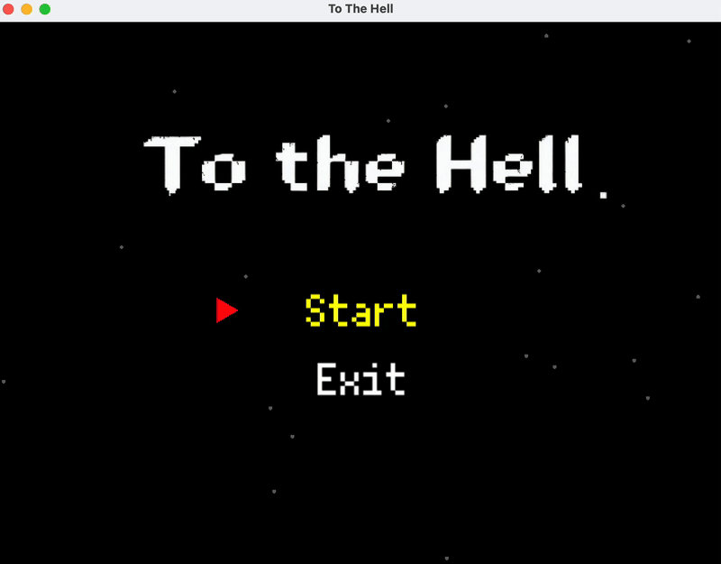

# To The Hell


## 👋🏻 游戏简介

<p align="center">
    
</p>

这是一个 Rougelike 风格的游戏,采用经典的"是男人就下100层"的玩法,玩家需要在地牢中不断探索,击败敌人,尽可能取得更高的分数。

## 🚀 快速开始

### 📒 安装说明

```bash
git clone https://hithub.com/yelan187/to_the_hell
cd to_the_hell
makedir build && cd build
cmake ..
make
```

注:初次执行`cmake ..` 可能需要安装一些依赖,耗时较长

### 🎮 运行游戏

```bash
cd build/bin
./ToTheHell
```

## 🛠️ 开发者指南

请查阅 [CONTRIBUTING.md](CONTRIBUTING.md) 文件。

## 🏗️ 技术架构

游戏使用 C++ 语言开发,采用了 **MVVM** 的设计模式。主要使用了以下技术栈:

- C++17
- SFML 用于图形渲染和音频处理
- CMake 用于构建系统

## 📚 项目历史

本项目最初于2023年由 [Eclipsky](https://github.com/Yitian26) 和 [yelan](https://github.com/yelan187) 以Python版本开发并发布于[原始仓库](https://github.com/Yitian26/to_the_hell)。

现版本（C++重写）作为浙江大学计算机学院"课程综合实践II"的项目，由以下成员共同开发：
- [yelan](https://github.com/yelan187)
- [WuYan](https://github.com/wuyan1345)
- [XuebaStudy](https://github.com/XuebaStudy)

## 👏🏻 致谢

感谢以下(上文未提到的)开源项目支持：

- [Fusion Pixel Font](https://github.com/TakWolf/fusion-pixel-font) - 开源像素字体

### ✨ 角色设计灵感

游戏主角的形象设计灵感来源于B站UP主 [Warma](https://space.bilibili.com/53456)。本项目是非商业性质的学习作品，仅作学习交流用途。如有侵权，请联系我们删除。

## 📄 许可证

本项目采用 [MIT 许可证](LICENSE) 开源。您可以自由使用、修改和分发代码，但请保留原作者的版权声明和许可证信息。